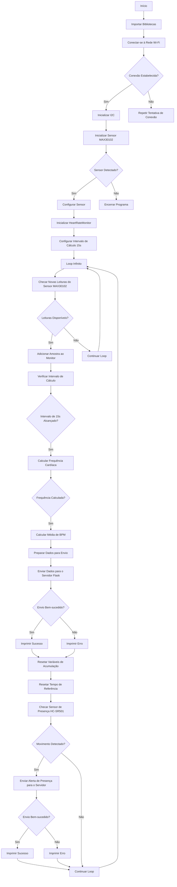

#Fluxograma main_bpm_presenca.py

```mermaid
graph TD
    A[Início] --> B[Importar Bibliotecas];
    B --> C[Conectar-se à Rede Wi-Fi];
    C --> D{Conexão Estabelecida?};
    D -- Sim --> E[Inicializar I2C];
    D -- Não --> F[Repetir Tentativa de Conexão];
    E --> G[Inicializar Sensor MAX30102];
    G --> H{Sensor Detectado?};
    H -- Sim --> I[Configurar Sensor];
    H -- Não --> J[Encerrar Programa];
    I --> K[Inicializar HeartRateMonitor];
    K --> L[Configurar Intervalo de Cálculo 15s];
    L --> M[Loop Infinito];
    M --> N[Checar Novas Leituras do Sensor MAX30102];
    N --> O{Leituras Disponíveis?};
    O -- Sim --> P[Adicionar Amostra ao Monitor];
    O -- Não --> Q[Continuar Loop];
    P --> R[Verificar Intervalo de Cálculo];
    R --> S{Intervalo de 15s Alcançado?};
    S -- Sim --> T[Calcular Frequência Cardíaca];
    T --> U{Frequência Calculada?};
    U -- Sim --> V[Calcular Média de BPM];
    V --> W[Preparar Dados para Envio];
    W --> X[Enviar Dados para o Servidor Flask];
    X --> Y{Envio Bem-sucedido?};
    Y -- Sim --> Z[Imprimir Sucesso];
    Y -- Não --> AA[Imprimir Erro];
    Z --> AB[Resetar Variáveis de Acumulação];
    AA --> AB;
    AB --> AC[Resetar Tempo de Referência];
    AC --> AD[Checar Sensor de Presença HC-SR501];
    AD --> AE{Movimento Detectado?};
    AE -- Sim --> AF[Enviar Alerta de Presença para o Servidor];
    AF --> AG{Envio Bem-sucedido?};
    AG -- Sim --> AH[Imprimir Sucesso];
    AG -- Não --> AI[Imprimir Erro];
    AH --> AJ[Continuar Loop];
    AI --> AJ;
    AE -- Não --> AJ;
    Q --> M;
    AJ --> M;


```
